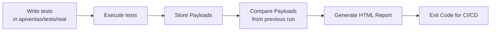

# APIVERITAS

A CLI tool for consumer-driven contract testing using JSON comparisons.

[](https://github.com/mariogalea/qualitymatters-apiveritas/actions/workflows/ci_github_actions.yml/badge.svg)
[](https://github.com/mariogalea/qualitymatters-apiveritas)

**APIVERITAS** — Because your endpoints shouldn’t gaslight your frontend.

A lightweight, CI-friendly contract testing tool for RESTful APIs. APIVERITAS ensures that your API responses stay consistent, honest, and predictable across environments and deployments.   

<br>
<br>

## Feature Highlights

- **Schema Validation**  
  Validate API responses against strict or flexible JSON Schemas to ensure structural integrity and type correctness.

- **Payload Comparison**  
  Compare live (production/dev) API responses against baseline payloads to detect unexpected changes and regressions.

- **Configurable Test Suites**  
  Customize behavior using a `config.json` file — control schema strictness, mock server usage, report paths, and more.

- **HTML Reporting**  
  Generate clear, collapsible, and human-readable HTML reports with inline diffs for easy debugging.

- **CI/CD Integration**  
  Designed to plug seamlessly into your CI pipelines — fail builds when contracts are broken, and track API integrity over time.

- **Clean Architecture**  
  Built with modular, object-oriented TypeScript for extensibility, maintainability, and clean separation of concerns.

- **Mock Server Support**  
  Use an optional mock server with predefined responses for testing in isolated or offline environments — ideal for CI and sandbox testing.


<br>
<br>

## Installation
APIVERITAS can be installed in different ways - either globally or locally.  


### Global Installation

To install APIVERITAS globally:

```bash
npm install -g apiveritas
```

Initialize before use via:

```bash
apiveritas init
```

#### Why use `-g`?

Using the `-g` flag installs APIVERITAS globally, making the `apiveritas` command available from anywhere on your system. This is useful when:

- You want to run the CLI across multiple projects.
- You're integrating it into global workflows or CI/CD pipelines.
- You prefer not to manage a local dependency for every individual project.

Global installation provides convenience and consistency, especially for tools designed to work across repositories or environments.


### Local Installation

You can also install APIVERITAS as a local development dependency:

```bash
npm install --save-dev apiveritas
```

Initialize before use via:

```bash
apiveritas init
```

#### Why use `--save-dev`?

- You want tighter version control per project.
- You prefer not to install the CLI globally.
- You're sharing the project with collaborators or CI systems that use npm ci

<br>
<br>

## Usage

ApiVeritas provides a straightforward CLI with commands to manage and validate your API contracts efficiently. 

You can run commands to execute tests, generate reports, manage payload snapshots, and configure your testing environment. Each command is designed to integrate seamlessly into your development workflow and CI/CD pipelines.

## Test Flow 


## CLI Commands

Below are the primary CLI commands you’ll use to get started and maintain API contract integrity.

```bash
Usage: apiveritas [options] [command]


A lightweight CLI tool for API contract testing

Options:
  -V, --version         output the version number
  -h, --help            display help for command

Commands:
  init [options]        Initialize ApiVeritas folder structure with template files
  test [options]        Run all API requests and save responses
  list-tests            List all available JSON test files in the tests/ folder
  payloads-path         Show where the payloads are stored
  reports-path          Show where HTML reports are stored
  config                Show current configuration loaded from config.json
  set-config [options]  Update one or more config values
  compare [options]     Compare the two most recent payload folders and show test results
  run [options]         Run tests, compare payloads, and report results
  notest                A little surprise inspired by Pulp Fiction
  help [command]        display help for command
  ```
<br>


### init

Initialise the application an creates the below working folder structure:

```bash
apiveritas/
├── config.json
├── payloads/
├── reports/
└── tests/
    ├── mock/
    │   ├── mock.json
    │   └── mock-responses/
    │       └── *.json
    └── real/
        └── real.json
```

Example:

```bash
apiveritas init
```


### test

Run all API requests defined in a test suite JSON file and save the responses.

```bash
apiveritas test --tests <test-suite-file>
```

Example:

```bash
apiveritas test --tests bookings.json
```

*If mock server mode is enabled, the test suite will default to `mock.json`.

<br>

### list-tests

List all available JSON test files in the `tests/` directory.

```bash
apiveritas list-tests
```

<br>

### payloads-path

Show the current path where payloads are stored.

```bash
apiveritas payloads-path
```

<br>

### reports-path

Show the current path where HTML reports are stored.

```bash
apiveritas reports-path
```

<br>

### config

Display the current loaded configuration from `config.json`.

```bash
apiveritas config
```

<br>

### set-config

Update configuration values interactively or via flags.

Options:

- `--strictSchema <boolean>`
- `--strictValues <boolean>`
- `--tolerateEmptyResponses <boolean>`
- `--payloadsPath <path>`
- `--reportsPath <path>`
- `--baseUrl <url>`
- `--enableMockServer <boolean>`

#### Configuration Flags

- `--strictSchema <boolean>`  
  Enforce strict JSON schema validation. When `true`, any deviation from the defined schema will cause the test to fail.  When `false`, added json properties are permitted (missing ones will fail the comparison test).

- `--strictValues <boolean>`  
  Enforce strict value matching. When `true`, differences in response values (beyond schema) will cause test failures.

- `--tolerateEmptyResponses <boolean>`  
  Allow empty API responses without failing the test. Useful when some endpoints may legitimately return empty payloads.

- `--payloadsPath <path>`  
  Shows the directory path where API response payloads are stored for comparison and reference.

- `--reportsPath <path>`  
  Shows the directory path where HTML test reports are saved after comparison runs.

- `--baseUrl <url>`  
  Define the base URL of the API server to be tested.

- `--enableMockServer <boolean>`  
  Enable or disable the internal mock server. When `true`, tests use mock responses instead of hitting a live API.


Example:

```bash
apiveritas set-config --strictSchema true --baseUrl http://localhost:8080
```

<br>

### compare

Compare the two most recent payload folders for a given test suite and report differences.

```bash
apiveritas compare --testSuite <name>
```

Example:

```bash
apiveritas compare --testSuite bookings
```

<br>

### run

Run a full workflow: execute API calls, save responses, and compare the latest payload folders.

```bash
apiveritas run --tests <test-suite-file> --testSuite <name>
```

Example:

```bash
apiveritas run --tests bookings.json --testSuite bookings
```

*If mock server mode is enabled, the test suite will default to `mock.json`, targeting base url http://localhost:3000

<br>

### notest

A fun easter egg inspired by *Pulp Fiction*.

```bash
apiveritas notest
```

<br>


## Mock Server Mode

When enabled (`enableMockServer: true`), ApiVeritas runs an internal mock server and uses `mock.json` test suite by default. This allows testing without a live API.

<br>
<br>

## ✅ CI Setup Snippet (GitHub Actions)

```yaml
name: CI

on:
  push:
    branches: [ main ]

jobs:
  verify-contracts:
    runs-on: ubuntu-latest
    steps:
      - name: Checkout
        uses: actions/checkout@v3

      - name: Setup Node.js
        uses: actions/setup-node@v4
        with:
          node-version: '20'

      - name: Install dependencies
        run: npm ci

      - name: Install ApiVeritas globally
        run: npm install -g .

      - name: Run contract tests
        run: apiveritas run --tests mock.json --testSuite mock
```
<br>
<br>

## Exit Codes

APIVERITAS uses the following exit codes to indicate the result of CLI operations. This helps with scripting, CI pipelines, and automated monitoring.

| Exit Code | Meaning                                   |
|-----------|-------------------------------------------|
| 0         | Success                                   |
| 1         | General error (unexpected)                |
| 2         | Missing or invalid arguments              |
| 3         | Configuration error                       |
| 4         | Test suite loading error                  |
| 5         | API call failure                          |
| 6         | Comparison failure (payload diff found)   |
| 7         | Mock server error                         |


<br>
<br>

## Author

Mario Galea – [GitHub](https://github.com/mariogalea)

<br>
<br>


## License

This project is licensed under the MIT License — see the [LICENSE](./LICENSE) file for details.
